# 👞👞Peter's Shoe Store 2👟👟
> Online store for selling shoes.

## Features

- Made with Laravel, JS, jQuery
- Admin Panel: Login, Orders, Products, Users (CRUD)
- Front end store: Login, Homepage, Cart, Checkout, Profile, Order Details

---

# Screenshots

## Admin Panel
- Dashboard
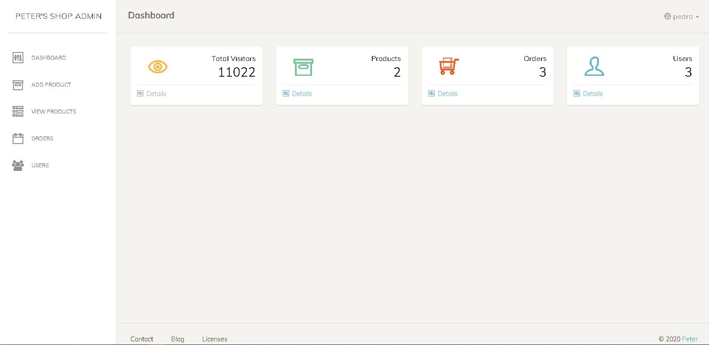
- All products
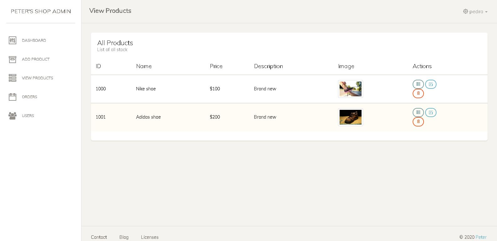
- Create/Edit product
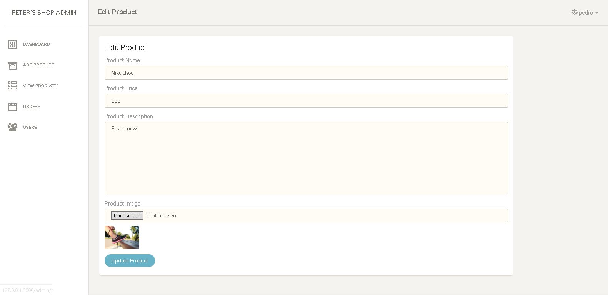
- Single product details
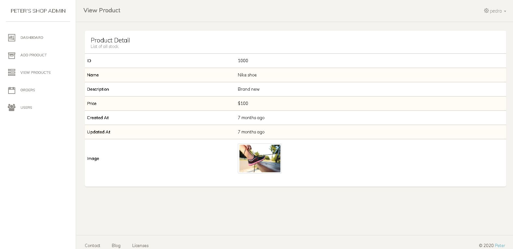
- All orders
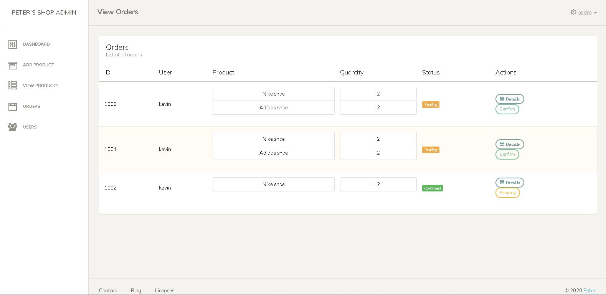
- Single order details
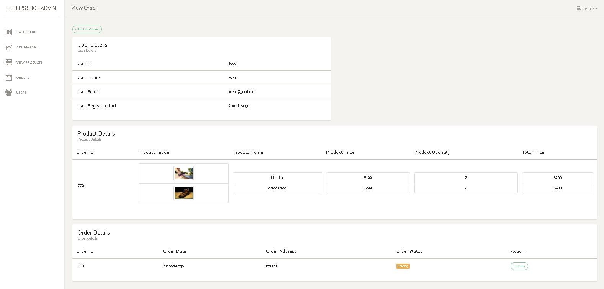
- Users
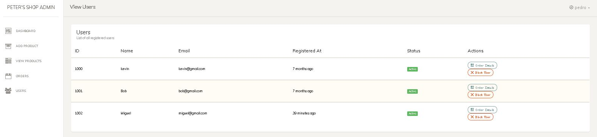

## User Front-end
- Homepage

- Shopping Cart
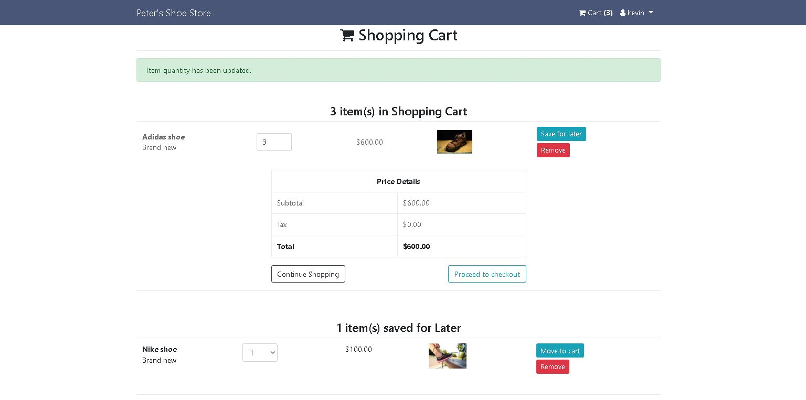
- Checkout
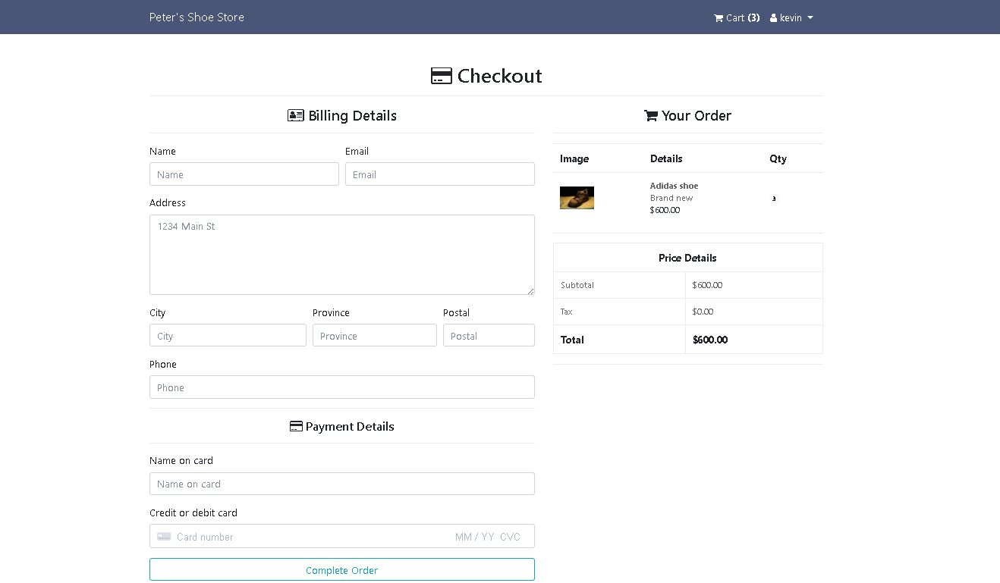
- User Profile
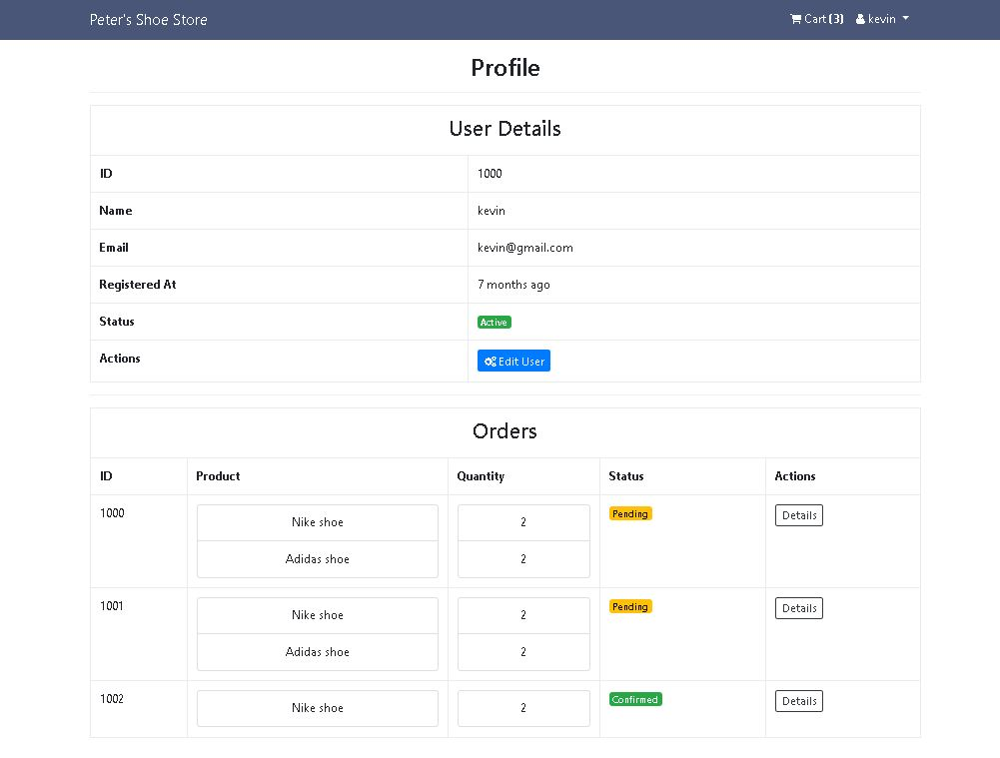
- User Order Details
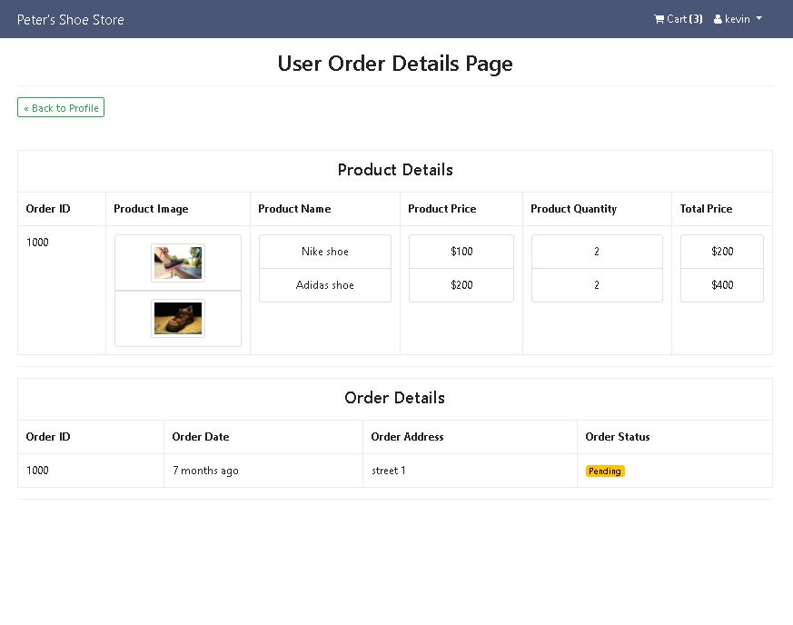

---

## License

- **[MIT license](http://opensource.org/licenses/mit-license.php)**
- Copyright 2020 © <a href="https://github.com/teafoot" target="_blank">teafoot</a>
